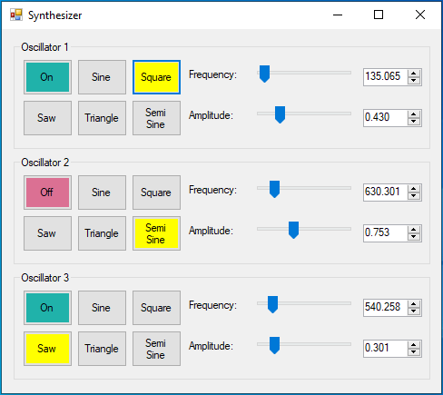

# Synthesizer

This project is a simple synthesizer made using C#. It consists of 3 oscillators. For each oscillator, you can set the frequency, amplitude and wave type. You can enable all 3 oscillators at the same time and layer the audio that is produced. 

## Screenshots

## Download

